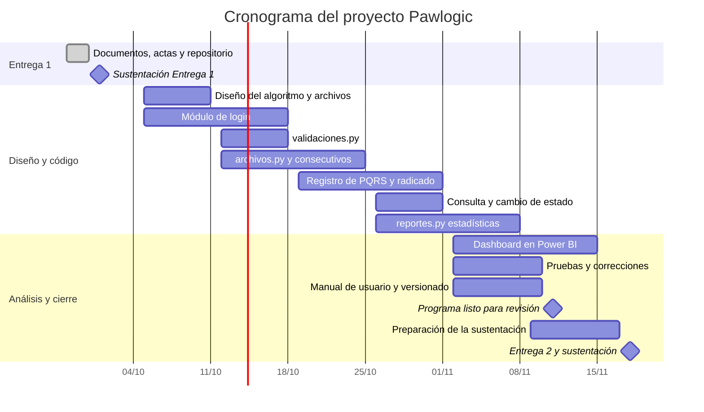

# Pawlogic

**Pawlogic** es un gestor de PQRS (Peticiones, Quejas, Reclamos y Sugerencias) por consola, desarrollado en Python, que apoya al Movimiento Estudiantil de Perritos y Gaticos (MEPEGA) en la atención de perros y gatos en la Universidad de Antioquia.

## 1. Integrantes

| Nombre | Programa académico | Rol |
|--------|--------------------|-----|
 | Maryerlis Herrera de Arcos | Ingeniería Industrial | Líder del equipo y gestora del repositorio |
| Valeria López Silva | Ingeniería Industrial | Responsable de planeación y presupuesto |
| Jehren Esther Padilla Villalba | Ingeniería Industrial | Responsable de documentación |
| Isabella Barros Correa | Ingeniería Industrial | Responsable de imagen y presentación |

## 2. Vínculos académicos y descripción

### Maryerlis Herrera de Arcos (líder del equipo)
- **Programa académico:** Ingeniería Industrial
- **Habilidades y fortalezas:** buena para exponer y comunicarse con claridad. Maneja Excel, lo que ayuda con la parte de estadísticas del proyecto.

### Isabella Barros Correa
- **Programa académico:** Ingeniería Industrial
- **Habilidades y fortalezas:** se le facilita hacer cuentas y maneja Excel, por lo que puede apoyar el presupuesto y los cálculos. Es puntual cuando su disponibilidad se lo permite.

### Valeria López Silva
- **Programa académico:** Ingeniería Industrial
- **Habilidades y fortalezas:** buena para organizar y redactar, lo que aporta a la documentación. Se defiende en Excel y se comunica bien.

### Jehren Esther Padilla Villalba
- **Programa académico:** Ingeniería Industrial
- **Habilidades y fortalezas:** se defiende en Excel, es puntual y expone bien.

## 3. Nombre del proyecto y detalles

**Nombre:** Pawlogic

**Significado:** unión de *Paw* (pata) y *Logic* (lógica). Representa un sistema ordenado y eficiente para gestionar la atención de perros y gatos.

**Descripción:** programa de consola que permite registrar PQRS con validación de datos, guardarlas en archivos planos independientes por tipo, generar un comprobante de radicado y consultar su estado. Reemplaza el registro manual en papel y lápiz que hoy usa MEPEGA.

**Logo:** ver la carpeta `images/` (pendiente).

## 4. Licencia del software

**Licencia elegida:** Creative Commons Atribución-NoComercial-CompartirIgual 4.0 Internacional (CC BY-NC-SA 4.0).

**Enlace:** https://creativecommons.org/licenses/by-nc-sa/4.0/

**Justificación:**
- **Atribución (BY):** cualquier persona que use o adapte Pawlogic debe reconocer al equipo autor.
- **No comercial (NC):** el software se desarrolla con fines académicos y de apoyo a un movimiento estudiantil, por lo que no debe venderse.
- **Compartir igual (SA):** las versiones modificadas deben publicarse bajo esta misma licencia, para que el trabajo siga siendo abierto.

## 5. Reporte de visión

### Problema identificado

MEPEGA recibe PQRS (peticiones, quejas, reclamos y sugerencias) por varios medios: redes sociales, correo electrónico, papel y voz a voz. Hoy los estudiantes las procesan a papel y lápiz y les asignan a mano un número consecutivo. Esto genera riesgo de números repetidos o saltados, datos incompletos o mal escritos, dificultad para consultar el estado de cada solicitud y ningún control claro sobre el plazo máximo de respuesta de 30 días.

### Propuesta de valor

Pawlogic es un programa de consola que centraliza el registro de las PQRS. Valida cada dato antes de guardarlo, asigna automáticamente un radicado consecutivo y sin repetir, calcula la fecha máxima de respuesta, guarda cada tipo de solicitud en su propio archivo y entrega un comprobante impreso en texto. Además, exige iniciar sesión, de modo que cada registro queda asociado a quien lo ingresó.

### Objetivo general

Reemplazar el registro manual de PQRS de MEPEGA por un sistema en Python, ordenado y confiable, que apoye la atención de perros y gatos en la Universidad de Antioquia.

### Objetivos específicos

- Controlar el acceso al sistema con usuario y contraseña, con máximo 3 intentos y bloqueo temporal.
- Registrar las PQRS con validación estricta de los datos del solicitante y de la solicitud.
- Guardar cada tipo de PQRS en un archivo independiente, con su propio consecutivo.
- Generar un comprobante de radicado en texto, de 120 caracteres de ancho.
- Permitir consultar las PQRS y su estado, y calcular estadísticas para medir la atención.

### Beneficios

- **Orden:** consecutivos automáticos, sin números repetidos.
- **Calidad de los datos:** las validaciones evitan errores de digitación.
- **Control de tiempos:** cada PQRS tiene su fecha máxima de respuesta.
- **Trazabilidad:** se sabe qué usuario registró cada solicitud.
- **Ahorro de tiempo:** se reduce el trabajo a papel y lápiz.

### Alcance

**Incluye:** inicio de sesión, registro y validación de PQRS, almacenamiento en cuatro archivos planos, radicado en texto, consulta de estado y estadísticas.

**No incluye:** interfaz gráfica ni base de datos en servidor. Es un programa de consola que trabaja con archivos planos.

## 6. Especificación de requisitos

### Requisitos funcionales

| Código | Requisito |
|--------|-----------|
| RF-01 | El sistema exige iniciar sesión antes de mostrar el menú principal. El acceso se hace con usuario o correo institucional y contraseña. |
| RF-02 | El sistema verifica las credenciales contra un archivo de usuarios autorizados, y solo permite el ingreso a usuarios activos. |
| RF-03 | Después de 3 intentos fallidos, el sistema bloquea el acceso por un tiempo definido por el equipo y muestra ese tiempo en pantalla. |
| RF-04 | Al iniciar sesión, el sistema guarda los datos del usuario activo y los vincula automáticamente a cada PQRS que registra. |
| RF-05 | El sistema permite registrar una PQRS con los datos del solicitante (nombre, documento, teléfono, correo y dirección), la información de la solicitud (tipo, fecha, canal, asunto y descripción), el tipo de mascota y el campus relacionado. |
| RF-06 | El sistema valida cada dato antes de guardarlo (longitud, formato, valores permitidos y fechas no futuras) y avisa cuál dato es inválido. |
| RF-07 | El sistema asigna un ID entero consecutivo y sin repetir a cada PQRS, con una secuencia independiente para cada archivo. Los registros nuevos continúan la numeración de las bases entregadas. |
| RF-08 | El sistema calcula la fecha máxima de respuesta sumando 30 días calendario a la fecha de radicación. |
| RF-09 | Toda PQRS inicia en estado "Registrada" y solo puede avanzar en este orden: Registrada, En proceso, Solucionada. |
| RF-10 | El sistema guarda las PQRS en cuatro archivos planos independientes: Peticion.txt, Queja.txt, Reclamo.txt y Sugerencia.txt. |
| RF-11 | El sistema imprime un radicado en texto, con marco ASCII y ancho fijo de 120 caracteres. No incluye la descripción detallada y muestra "N/A" si no hay dirección. |
| RF-12 | El sistema permite consultar el estado de las PQRS y verlas con el formato del radicado. |
| RF-13 | El sistema calcula estadísticas: el promedio de días de respuesta, la distribución por tipo de mascota, canal y campus, el porcentaje de PQRS solucionadas y las PQRS próximas a vencer o vencidas. |
| RF-14 | El sistema permite exportar los resultados a un archivo plano. |

### Requisitos no funcionales

| Código | Categoría | Requisito |
|--------|-----------|-----------|
| RNF-01 | Usabilidad | El programa usa un menú de consola claro, con opciones numeradas y mensajes de error fáciles de entender. |
| RNF-02 | Modularidad | El código se separa por responsabilidad: validaciones.py (validación de datos), archivos.py (lectura y escritura de los archivos) y reportes.py (estadísticas). |
| RNF-03 | Seguridad | El acceso está protegido con login obligatorio, límite de intentos y bloqueo temporal. La contraseña no se muestra al escribirla. |
| RNF-04 | Integridad de datos | Ningún registro se guarda si un dato no cumple las validaciones, y no hay consecutivos repetidos. |
| RNF-05 | Fiabilidad | Un dato incorrecto no cierra el programa: el sistema avisa y vuelve a pedirlo. |
| RNF-06 | Compatibilidad | El programa corre en cualquier computador con Python 3 instalado, sin necesidad de internet. |
| RNF-07 | Rendimiento | El sistema responde de forma inmediata con miles de registros por archivo. |
| RNF-08 | Mantenibilidad | El código está comentado y el repositorio sigue la estructura src, docs, images y data. |
| RNF-09 | Codificación | Los archivos usan UTF-8, para guardar bien tildes y la letra ñ. |

## 7. Plan de proyecto

### Actividades

| # | Actividad | Semanas | Fechas |
|---|-----------|---------|--------|
| 1 | Documentos de la Entrega 1, actas y repositorio | 9 | 28 sep - 30 sep |
| 2 | Diseño del algoritmo y de los archivos planos | 10 | 5 oct - 11 oct |
| 3 | Módulo de login (3 intentos y bloqueo) | 10 - 11 | 5 oct - 18 oct |
| 4 | validaciones.py | 11 | 12 oct - 18 oct |
| 5 | archivos.py (4 archivos y consecutivos) | 11 - 12 | 12 oct - 25 oct |
| 6 | Registro de PQRS y radicado de 120 caracteres | 12 - 13 | 19 oct - 1 nov |
| 7 | Consulta y cambio de estado | 13 | 26 oct - 1 nov |
| 8 | reportes.py (estadísticas) | 13 - 14 | 26 oct - 8 nov |
| 9 | Dashboard en Power BI (mínimo 3 páginas) | 14 - 15 | 2 nov - 15 nov |
| 10 | Pruebas y correcciones | 14 - 15 | 2 nov - 10 nov |
| 11 | Manual de usuario y plan de versionado | 14 - 15 | 2 nov - 10 nov |
| 12 | Programa completo listo para revisión del docente | 15 | 11 nov |
| 13 | Preparación de la sustentación final | 15 - 16 | 9 nov - 17 nov |
| 14 | Entrega 2 y sustentación | 16 | 18 nov |

Los responsables de cada actividad están en el [Acta de Responsabilidad](docs/acta_responsabilidad.md).

### Diagrama de Gantt

### Presupuesto

El proyecto no se paga en dinero sino en tiempo de práctica de formación. Cada integrante invierte 50 horas, valoradas a la tarifa de una práctica profesional equivalente al salario mínimo.

**Valores de referencia (2026):**

| Concepto | Cálculo | Valor |
|----------|---------|-------|
| Salario mínimo mensual (SMLMV) | Decreto 1469 de 2025 | $1.750.905 |
| Valor por día | SMLMV ÷ 30 | $58.363 |
| Valor por hora | Valor por día ÷ 8 horas | $7.295 |

**Costo por integrante:**

| Integrante | Horas | Valor por hora | Costo |
|------------|-------|----------------|-------|
| Maryerlis Herrera de Arcos | 50 | $7.295 | $364.750 |
| Isabella Barros Correa | 50 | $7.295 | $364.750 |
| Valeria López Silva | 50 | $7.295 | $364.750 |
| Jehren Esther Padilla Villalba | 50 | $7.295 | $364.750 |
| **Total** | **200** | | **$1.459.000** |

Las horas de cada integrante pueden variar según su disponibilidad. Si cambian, el costo se recalcula como horas × $7.295.
